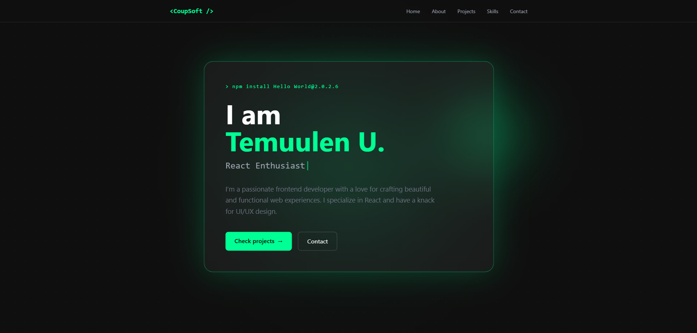

# Temuulen Undrakh Portfolio

A personal portfolio website built with React and Tailwind CSS to showcase my projects, skills, and frontend development journey.

## Live Demo

Portfolio Website: [View Live Site](https://coupsoft.vercel.app/)

### Preview

### About The Project

This project is my personal portfolio website, created to present who I am as a frontend developer and to showcase some of the projects I have worked on.

### Tech Stack

This project was built with:

React
Vite
Tailwind CSS
React Router
JavaScript (ES6+)

### Project Structure

src/
├── components/
│ ├── Navbar.jsx
│ ├── Hero.jsx
│ ├── About.jsx
│ ├── Project.jsx
│ ├── Skill.jsx
│ └── Contact.jsx
├── App.jsx
└── main.jsx

## Author

Temuulen U.

Frontend developer interested in building clean, responsive, and user-friendly web interfaces with React.
